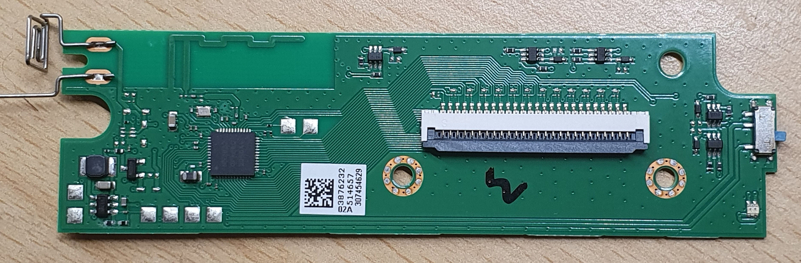
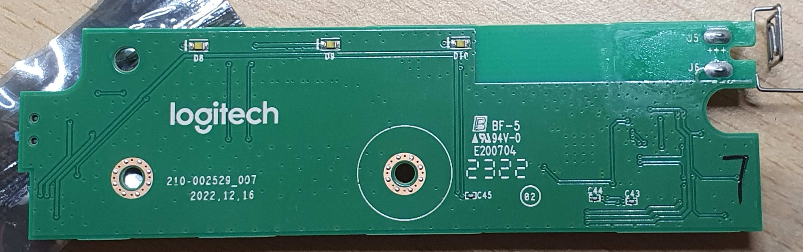

# Programming the K380 v2

## Description

Logitech released a new K380 keyboard which they call "Pebble Keys 2 K380s". For the
sake of sanity and reducing confusion we will call it K380v2 from here on out.

This keyboard uses an upgraded microcontroller from the original Broadcom one and has
a much simpler internal design through that. Instead of a carrier and MCU module
combination, the microcontroller and 2.4GHz antenna are directly on the PCB. Other
parts of the keyboard don't seem to have changed thoo in comparison to the original
K380.

The microcontroller is a Nordic nRF52832 (or for me a nRF52832QFABG0). Which is a
32bit ARM MCU with Bluetooth but no USB support. This has a few implications for us,
with the most significant one being that we can repurpose the keyboard without
needing to exchange or modify the vendor PCB.

> [!NOTE]
> This due to the fact, that the nRF52 series only allows enabling read protection of
> the flash through SWD, but don't allow unrecoverable locking of the chip. A chip
> can always be brought back into an unlocked, debuggable and programmable state by
> fully erasing the internal flash. This is documented and on purpose.




## Unlocking

As our PCB exposes the SWD header already it is really easy to connect a debugger to it.
See the PCB section (TODO) to see how to wire it up.

Throughout this section I'll use [pyOCD][pyocd] together with an STLink
Clone. But this can be done with SWD capable debugger and most OCD tool chains.

```bash
$ pyocd commander --target nrf52832
0001637 E Error probing AP#4: STLink error (29): Bad AP [discovery]
0001640 E Error probing AP#5: STLink error (29): Bad AP [discovery]
[…]
0001834 E Error probing AP#254: STLink error (29): Bad AP [discovery]
0001835 W NRF52832 APPROTECT enabled: not automatically unlocking [target_nRF52]
0001836 C Error: 'SoCTarget has no selected core' [__main__]
```

Simply trying to control the device already tells us what is wrong. Luckily there
already is a help page for that: [PyOCD: Security][pyocd-security] and the solution
is rather simple.

I first tried using `pyocd commander --target nrf52832 -O auto_erase`, but this
operation timed out. So instead I did it manually according to the documentation from
the chip ["Checking APPROTECT"][nrf-doc-approtect] and ["Erasing all"][nrf-doc-eraseall],
which mentions the edge case in which the chip doesn't change the ERASEALLSTATUS
register for more than 15s, in which a reset using the AP is required.

The process to manually erase the chip and bring it back into an unprotected mode is
with that:

```bash
$ pyocd commander -N                 # comments with # are my own addition
0001654 W Generic 'cortex_m' target type is selected by default; is this intentional? You will be able to debug most devices, but not program  flash. To set the target type use the '--target' argument or 'target_override' option. Use 'pyocd list --targets' to see available targets types. [board]
Connected to CoreSightTarget [no init mode]: XXXXXXXXXXXXXXXXXXXXXXXX
pyocd> initdp
pyocd> readap 1 0x00C
AP register 0x100000c = 0x00000000   # 0x00C is APPROTECTSTATUS, 0 = protected
pyocd> writeap 1 0x004 1             # 0x004 is ERASEALL reg, 1 = starting the operation
pyocd> readap 1 0x008
AP register 0x1000008 = 0x00000001   # 0x008 is ERASEALLSTATUS reg, 1 = in progress
pyocd> readap 1 0x008
AP register 0x1000008 = 0x00000001

# […waiting for 15s]

pyocd> readap 1 0x008
AP register 0x1000008 = 0x00000001
pyocd> writeap 1 0x000 1             # 0x000 is RESET reg, 1 = issue reset
pyocd> writeap 1 0x000 0             # 0x000 is RESET reg, 0 = turn reset off
pyocd> writeap 1 0x004 0             # 0x004 is ERASEALL reg, 0 = stop operation
pyocd> readap 1 0x008
AP register 0x1000008 = 0x00000000   # our erase operation is stopped
pyocd> 
pyocd> readap 1 0x00C
AP register 0x100000c = 0x00000001   # 0x00C is APPROTECTSTATUS, 1 is unprotected - WHEE
```

And with that the chip is unlocked. ^^

> [!WARNING]
> The chip is now in clean slate mode. Due to the APPROTECT Bypass security issue,
> modern revisions of the nRF52 series will always lock in that state after a power
> cycle. But now we can use `-O auto_unlock` without issues. So keep that in mind.

## 

[pyocd]: https://pyocd.io/
[pyocd-security]: https://github.com/pyocd/pyOCD/blob/main/docs/security.md
[nrf-doc-approtect]: https://docs.nordicsemi.com/bundle/nwp_027/page/WP/nwp_027/nWP_027_approtect.html
[nrf-doc-eraseall]: https://docs.nordicsemi.com/bundle/nwp_027/page/WP/nwp_027/nWP_027_erasing.html
